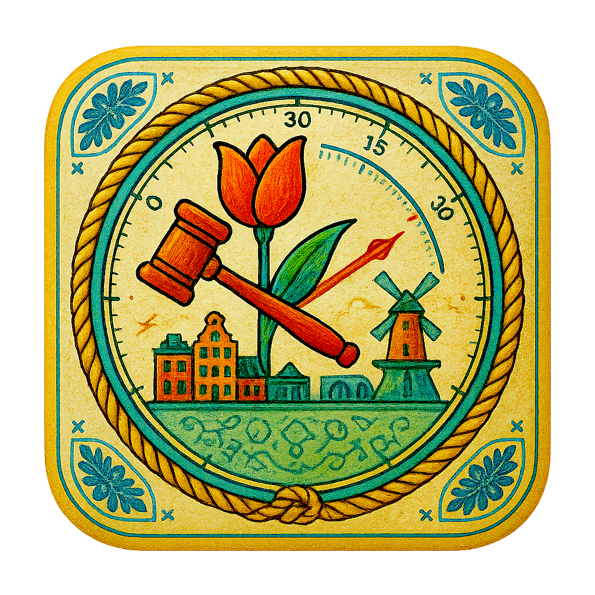
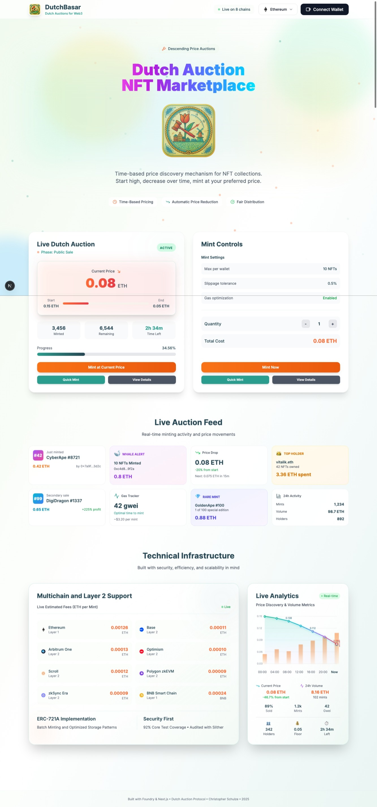

Links: [Documentation](./docs/documentation.md) · [Quick Start](#quick-start) · [Features](#features) · [Benchmarks](#benchmarks-verified)

<br>

<p align="center">
  
</p>

<h1 align="center">DutchBasar</h1>

<p align="center">
  <a href="https://github.com/christopherschulze/DutchBasar/actions">
    
  </a>
  
  
  
  
  
    <br>
  <span style="display:inline-block;width:100%;height:0;line-height:0;"></span>
  
  
  
  
  
  
  
    <br>
  <span style="display:inline-block;width:100%;height:0;line-height:0;"></span>
  
  
  
  
</p>
  <br>

## Introduction

DutchBasar is an NFT marketplace built around the Dutch auction mechanism. It combines gas‑efficient smart contracts with a modern Next.js frontend and multi‑chain support (with a focus on L2s) to deliver a fast and cost‑effective user experience.

## Design goals

DutchBasar aims to provide a modern, reliable, and broadly accessible way to trade NFTs using Dutch auctions:

- Efficient and low‑cost auctions and mints through careful contract design and chain‑appropriate optimizations
- Fast, smooth user workflows and a responsive interface
- Broad chain coverage across major L2s for low fees and reach
- Broad wallet support to onboard as many users as possible
- Operational safety by design: circuit breaker, time‑locked admin controls
- Clear developer experience and maintainable APIs

## Features

### Core Features

#### Smart Contract Architecture
- **Dutch Auction Engine** - Linear price decay from `startPrice` to `endPrice` with millisecond precision
- **EIP-712 Signature Minting** - Gasless transactions with cryptographic signature verification
- **Bitmap Allowlist** - 256 addresses per storage slot for maximum gas efficiency
- **Gas Optimizations** - ERC‑721A base, bitmap allowlist, tight storage packing, calldata usage, minimized writes/events
- **Flash Loan Protection** - Prevents same-block manipulation attacks
- **Circuit Breaker Pattern** - Emergency pause with 48-hour time-locked recovery
- **Dynamic NFT Evolution** - 4 stages based on holding duration (30/60/90/180 days)
- **Cross-Chain Bridge Support** - LayerZero integration for seamless NFT transfers
- **ERC-2981 Royalties** - On-chain royalty enforcement across marketplaces

#### Frontend Experience
- **Real-Time Price Chart** - Canvas-based visualization
- **Live Activity Feed** - WebSocket-powered mint events
- **Wallet Connections (Wagmi/RainbowKit)** - MetaMask, WalletConnect, and more
- **Optimistic UI Updates** - Instant feedback with background transaction processing
- **Mobile Responsive** - Touch-optimized interface for all screen sizes

#### Testing & Quality
- **Comprehensive Testing** - 84/84 tests passing; core contract 92.39% line coverage


### Extension Modules (Optional)

Extensions for advanced use cases:

- **Multi-Signature Wallet** - 2-of-3 signature requirement for critical operations
- **AI-Powered Pricing** - Chainlink oracle integration for market-based pricing
- **DAO Governance** - On-chain voting with delegation and time locks
- **NFT Staking** - Yield generation with boost mechanics

<div align="center">
  
  <p><em>Live Dutch Auction Interface with Real-time Price Updates</em></p>
</div>

## Benchmarks (verified)

<div align="center">

| Operation | Gas (measured) |
|-----------|-----------------|
| Allowlist mint (bitmap) | 159,992 |
| Public mint (single) | 123,192 |
| Batch mint (10) total | 340,866 |
| Batch mint (per NFT) | 34,086 |
| reveal (average) | 64,034 |
| configureAuction (average) | 71,670 |

</div>

### Performance metrics (from latest build)
```yaml
First Load JS: 173 KB
```

</div>

## Technical Architecture

```
┌──────────────────────────────────────────────────────────────┐
│                    Frontend (Next.js 15)                     │
│  ┌──────────────┐   ┌──────────────┐   ┌──────────────────┐  │
│  │  Wagmi v2    │   │  RainbowKit  │   │  UI Components   │  │
│  │  Hooks       │   │  Wallets     │   │  (shadcn/ui)     │  │
│  └──────────────┘   └──────────────┘   └──────────────────┘  │
└──────────────────────────────┬───────────────────────────────┘
                               │ viem
┌──────────────────────────────▼───────────────────────────────┐
│                     Smart Contracts (EVM)                    │
│  ┌──────────────┐   ┌──────────────┐   ┌──────────────────┐  │
│  │  DutchBasar  │   │   Factory    │   │     Merkle       │  │
│  │   ERC-721A   │   │   Deployer   │   │    Allowlist     │  │
│  └──────────────┘   └──────────────┘   └──────────────────┘  │
└──────────────────────────────────────────────────────────────┘
```

### Contract Deployment & Configuration

```solidity
// Deploy with optimal settings
DutchBasar auction = new DutchBasar(
    "Collection Name",
    "SYMBOL",
    "ipfs://unrevealed/",
    owner,
    royaltyRecipient,
    500 // 5% royalty
);

// Configure auction parameters
auction.configureAuction(
    1 ether,     // startPrice
    0.1 ether,   // endPrice  
    startTime,   // unix timestamp
    endTime,     // unix timestamp
    100          // price drop interval (seconds)
);

// Set mint limits
auction.configureMint(
    10000,       // maxSupply
    5,           // maxPerWallet
    10           // maxPerTransaction
);
```

## Quick Start

```bash
# Clone and setup
git clone https://github.com/christopherschulze/DutchBasar.git
cd DutchBasar

# Frontend
cd app && bun install
cp .env.local.example .env.local
# Add your WalletConnect ID to .env.local
# Set your deployed contract addresses via NEXT_PUBLIC_* variables per chain (see below)
bun run dev

# Contracts (separate terminal)
cd contracts && forge install
forge test --gas-report
```

After completing the steps above, the app should run locally.

## Contract deployment

### Contracts
```bash
# Mainnet
forge script Deploy --rpc-url mainnet --broadcast --verify

# L2s (Base, Arbitrum, etc.)
forge script Deploy --rpc-url base --broadcast --verify --priority-gas-price
```

 

## Multi-Chain Deployment

### Supported Networks

- Base (8453)
- Optimism (10)
- Arbitrum (42161)
- zkSync Era (324)
- Scroll (534352)
- Polygon (137)
- Ethereum (1)
- BSC (56)

Each network includes testnet support. Contract addresses are configured via environment variables; no code changes required.

## Additional benchmark notes

See `contracts/test/Benchmarks.t.sol` for methodology and scenarios.

## Development

```bash
# Start development services
make dev

# Runs common development services such as contract tests, frontend dev server, and profiling tools.
```

### Testing
```bash
forge test -vvv --fuzz-runs 10000   # Solidity tests with fuzzing
forge coverage --report lcov        # Coverage report (66.74% line coverage)
bun test --watch                    # Frontend tests
```

**Test Status**: 84/84 tests passing (100%)
**Coverage**: +73% lines, +81% functions
**Core Contract**: +92% line coverage for DutchBasar.sol

## Production Deployment

### Infrastructure Requirements

```yaml
Minimum:
  - Node.js: 18.x LTS
  - Memory: 512MB
  - CPU: 1 vCPU
  - Storage: 1GB

Recommended:
  - Node.js: 20.x LTS  
  - Memory: 2GB
  - CPU: 2 vCPU
  - Storage: 5GB
  - CDN: CloudFlare or similar
```

### Deployment Options

**Vercel (Recommended)**
```bash
vercel deploy --prod
```

**Docker**
```bash
docker build -t dutchbasar .
docker run -p 3000:3000 dutchbasar
```

**Self-Hosted**
```bash
bun run build
pm2 start "bun start" --name dutchbasar
```

## Project Structure

```
DutchBasar/
├── app/                    # Next.js frontend
│   ├── src/
│   │   ├── app/           # App router pages
│   │   ├── components/    # React components
│   │   ├── hooks/         # Custom hooks (useDutchBasar)
│   │   └── lib/           # Wagmi config, utils
│   └── public/
├── contracts/              # Foundry project
│   ├── src/               # Solidity contracts
│   ├── test/              # Comprehensive test suite
│   └── script/            # Deployment scripts
└── docs/
    └── documentation.md    # Full technical docs
```

## Contributing

Contributions are welcome. Please open an issue or pull request with a clear description of the change.

### Conventions

- Branch naming: `feature/<short-topic>`, `fix/<short-topic>`, `chore/<short-topic>`, `docs/<short-topic>`
- Commit format (Conventional Commits): `type(scope): short summary`
  - Types: `feat`, `fix`, `chore`, `docs`, `refactor`, `test`, `build`
- Keep PRs small and focused; include rationale and, if relevant, gas impacts.

```bash
# Fix something
gh repo fork && git checkout -b fix/something
make test && git commit -m "fix: something"
gh pr create
```

**Merge criteria:**
- Tests pass
- Gas usage is not degraded (measured where applicable)
- No stray console logs
- API changes are justified with clear rationale

## Documentation

### Available Resources

- **[Technical Documentation](./docs/documentation.md)** - Complete API reference, architecture diagrams, and integration guides
- **[Contract Tests](./contracts/test/)** - 84 comprehensive test cases with gas benchmarks
- **[Frontend Components](./app/src/components/)** - Reusable React components with TypeScript definitions
- **[Deployment Scripts](./contracts/script/)** - Automated deployment for all supported networks

### API Quick Reference

```typescript
// Core contract functions
getCurrentPrice(): uint256              // Real-time auction price
getCurrentPhase(): Phase                // NotStarted | Allowlist | Public | Ended
getRemainingSupply(): uint256           // Available NFTs
publicMint(quantity): payable           // Public minting
allowlistMint(quantity, proof): payable // Merkle proof minting
signatureMint(qty, sig): payable        // EIP-712 gasless minting
```

## Community & Support

- **GitHub Issues** - Bug reports and feature requests
- **Discussions** - Technical questions and proposals

## Acknowledgments

Built with best-in-class tools:
- [OpenZeppelin](https://openzeppelin.com) - Security standards
- [Foundry](https://getfoundry.sh) - Testing framework
- [Wagmi](https://wagmi.sh) - React hooks
- [RainbowKit](https://rainbowkit.com) - Wallet connections

## Author

**Christopher Schulze**  

## License

MIT License - see [LICENSE](./LICENSE) for details

---

